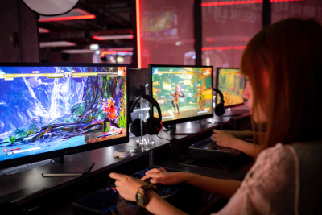

# Professional

In 5 years time, I would like to be able to speak of my previous and ongoing work. My goal as a UX Designer is to ultimately land a job in a Game Design firm, as Game Design and UX design share a lot in common (both are about designing an experience for users). Therefore, my goals are as follows:

- Hired at a game design firm or games studio
- Create and publish a game of my own on Steam
- Be designing assets and gameplay for video games

