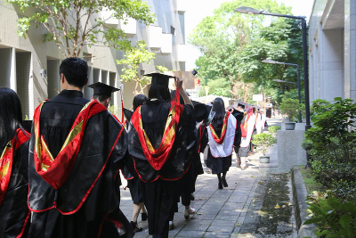

# Educational

In 5 years time, I would have graduated by then, and I would like to have graduated with a decently high GPA. I think I can put a lot more in educational goals apart from simply graduating! After all, we never stop learning. So, these are my educational goals, or things that I would like to have done in the next 5 years:

- Graduate with at least a 10.4/12.0 GPA (~3.4 equivalent)
- Learn how to sew my own clothes
- Learn other programming languages, like C# or Rust

